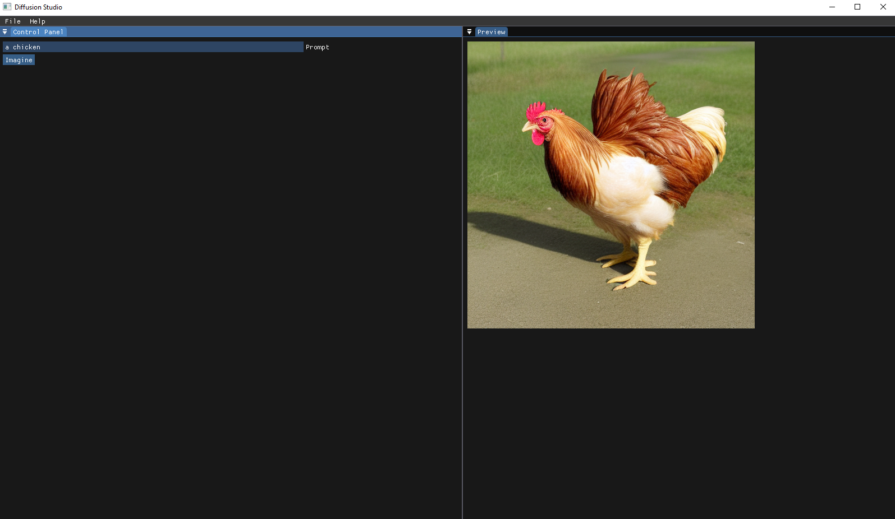

# Diffusion Studio



A *work in progress* app to create content using generative AI.

It uses the `stable-diffusion.cpp` library, which implements popular text-to-image model architectures.

The user needs to have downloaded an SD 1.5 `.safetensors` model, at the moment the model path can be changed from `./src/dl/sd_instance.cpp`.

## Setup

Clone the repo with the submodules:
```sh
git clone --recursive https://github.com/stefanasandei/diffusion-studio.git
```

Or if you forgot `--recursive`, to fetch the git submodules after clone:
```sh
git submodule update --init
```

Afterwards it's the classic CMake setup:
```sh
mkdir build && cd build
cmake ..
```

Now open the project with Visual Studio, CLion or your editor of choice. 

Relevant files are in `./src/gfx/` (vulkan code for the imgui window), `./src/app` (ui logic for the panels) and `./src/dl` (where the magic happens, coroutines are used with a generator to stream the image renders to the ui).


## License

[MIT](LICENSE) © [Asandei Stefan-Alexandru](https://asandei.com). All rights reserved.
